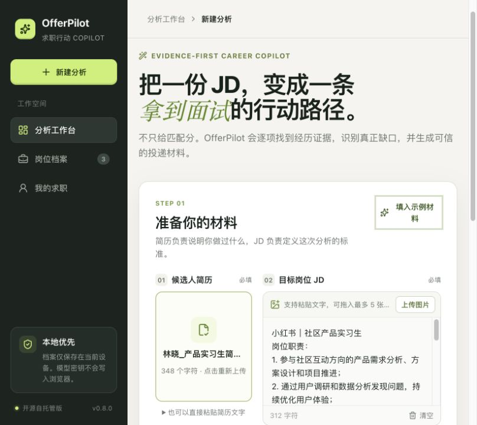
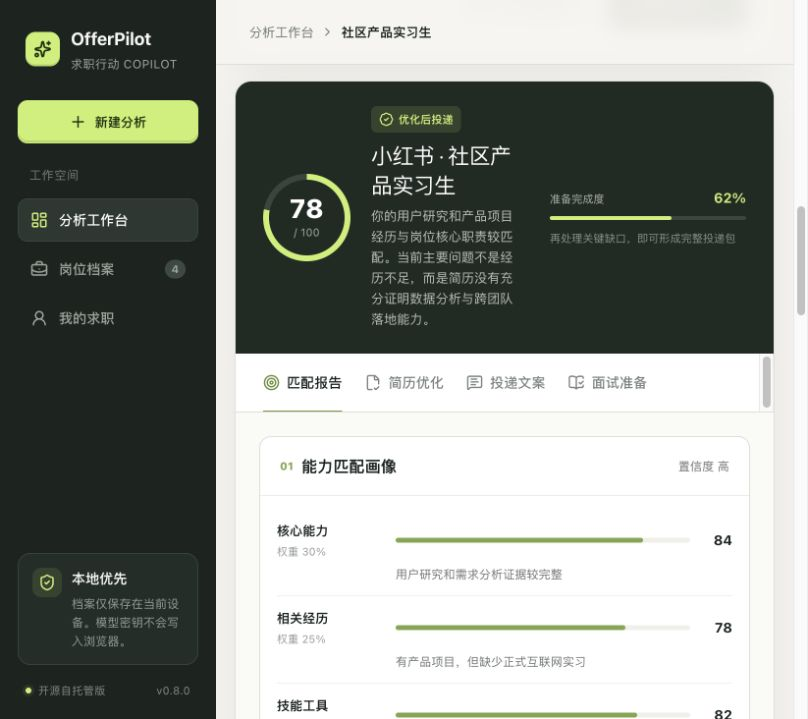
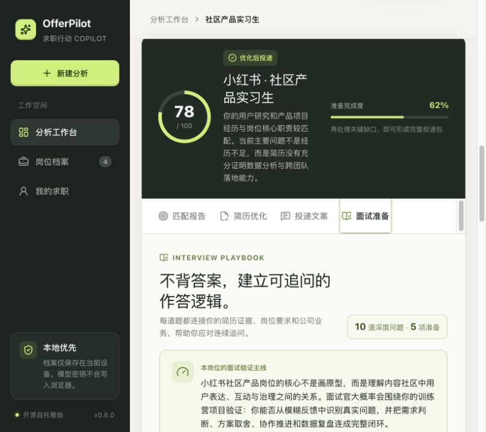

# OfferPilot

基于真实经历证据的开源求职 AI Copilot。当前版本：`v0.8.0`。

OfferPilot 不只给出一个“匹配分”，而是把岗位要求与简历经历逐项对应，区分表达缺口、信息缺口、准备缺口和硬性门槛，再生成可追溯的简历改写、投递文案与分阶段面试准备。

> 可直接从 GitHub 下载并在本地运行，无需第三方账号登录，也不依赖任何特定托管平台。无 API Key 时可使用内置示例完整体验；真实分析采用 BYOK（Bring Your Own Key）。

## 产品截图

### 分析工作台



### 可解释的人岗匹配报告



### 结合简历、JD 与业务背景的面试准备



## 核心价值

- 证据优先：把每项岗位要求连接到简历中的真实经历，避免只给笼统分数。
- 缺口可行动：区分表达不足、信息不足、准备不足和硬性门槛，并给出下一步。
- 事实约束：简历改写和投递文案只使用用户已经提供或确认的事实。
- 贯穿求职流程：覆盖首次分析、证据补全、投递材料和业务/HR 复试跟进。
- 本地优先与 BYOK：档案保存在当前设备，模型费用由用户自己的供应商账户结算。

## 已实现功能

- PDF、DOCX、TXT 简历解析，支持上传、拖拽或直接粘贴
- JD 文本粘贴与图片 OCR，最多 5 张，支持预览和单张删除
- 五维匹配评分与“岗位要求 × 简历证据”矩阵
- 缺口分类、投递建议与可解释结论
- 交互式证据补全、AI 充分性审核及分析前后变化
- 事实约束的简历优化建议
- 招聘平台沟通文案、投递邮箱识别与邮件文案
- 10 道针对性面试问题与 5 项准备清单
- 岗位档案保存、分页和状态区分
- 每个岗位各一次业务复试与 HR 复试跟进报告
- 豆包、千问、DeepSeek、智谱和 OpenAI 多供应商选择
- 自定义模型 ID、临时 API Key 和无密钥示例模式

## 3 分钟快速体验

要求 Node.js 22.13 或更高版本。

```bash
git clone https://github.com/Liiiii101010/offerpilot.git
cd offerpilot
npm install
npm run dev
```

打开 `http://localhost:3000`，点击“填入示例材料”后选择“用示例结果演示”。这条路径无需注册账号、无需 API Key，也不会产生模型费用。

## 使用真实模型

复制环境变量示例：

```bash
cp .env.example .env.local
```

在 `.env.local` 中填写任意一个供应商的 Key，也可以在页面中临时输入：

```bash
OPENAI_API_KEY=
ARK_API_KEY=
DASHSCOPE_API_KEY=
DEEPSEEK_API_KEY=
ZHIPU_API_KEY=
```

临时 Key 不写入 `localStorage`，请求完成后会从页面状态中清除。实际费用与模型权限由对应供应商结算和管理。

| 供应商 | 默认模型 | 接口模式 |
| --- | --- | --- |
| 火山方舟 | `doubao-seed-2-0-lite-260215` | OpenAI 兼容接口 |
| 阿里云百炼 | `qwen3.7-plus` | OpenAI 兼容接口 |
| DeepSeek | `deepseek-v4-flash` | OpenAI 兼容接口 |
| 智谱开放平台 | `glm-5.2` | OpenAI 兼容接口 |
| OpenAI | `gpt-5.6-luna` | Chat Completions |

模型名称和可用权限以供应商控制台为准，界面支持自定义模型 ID。

## 分析链路

```text
简历 / JD
  → 文档解析与岗位要求识别
  → 简历证据检索
  → 缺口分类与五维评分
  → 事实约束检查
  → 简历 / 文案 / 面试材料
  → 证据补全与复试跟进
```

后端只允许已配置模型供应商的 API 域名，避免前端任意指定请求目标。

## 技术栈

- React 19、TypeScript、Vinext、Vite
- Cloudflare Workers 兼容服务端运行时
- PDF.js、Mammoth.js、Tesseract.js
- 本地浏览器存储与多供应商模型 API

## 构建与检查

```bash
npm run test
npm run lint
```

## 隐私与安全

- 简历、个人资料和岗位档案默认只保存在当前浏览器。
- 请勿将 `.env`、真实 API Key 或候选人资料提交到仓库。
- 公开部署时建议继续采用 BYOK，或另行增加鉴权、限流和配额。
- 更完整的边界见 [PRIVACY.md](PRIVACY.md) 与 [SECURITY.md](SECURITY.md)。

## 已知边界

- 本项目是可演示 MVP，匹配结论不代表招聘企业的真实筛选结果。
- 扫描版 PDF 需要先进行 OCR；当前版本更适合文字版简历。
- AI 仍可能误判，所有改写都应由用户确认后再使用。
- 当前重点支持产品、运营、数据分析类初级岗位。

## 开源许可

项目自有代码采用 [MIT License](LICENSE)。第三方依赖、商标和虚构示例材料说明见 [NOTICE.md](NOTICE.md)。
